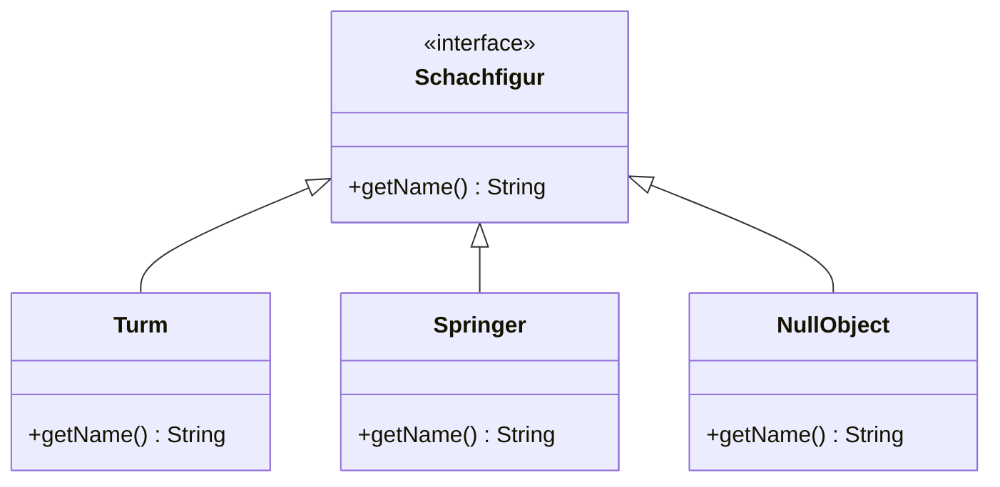

# Null Object Pattern
ein Objekt tut "nichts", was fachlich und gewollt ist

## Vorteile
- Verzicht auf Abfragen bzw. Exception-Behandlung
- Konzentration auf Fachlogik
- lesbarer Code

## Nachteile
- erheblicher Aufwand bei nachträglicher Umsetzung

## Beispiel
