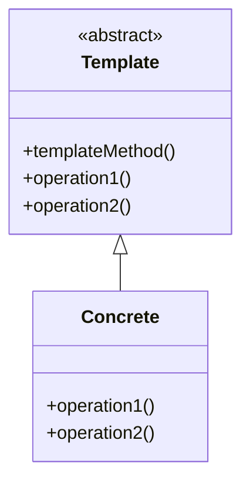

# Template Method Pattern
die Struktur eines Algorithmus, wobei einzelne, konkrete Schritte in Unterklassen verlagert werden. Operationen können überschrieben werden, ohne die Struktur des Algorithmus zu ändern

## Vorteile
- "invertierter Kontrollfluss": Aufruf der Operationen aus der Unterklasse und nicht umgekehrt → wichtige Grundlage für Wiederverwendung

## Beispiel
