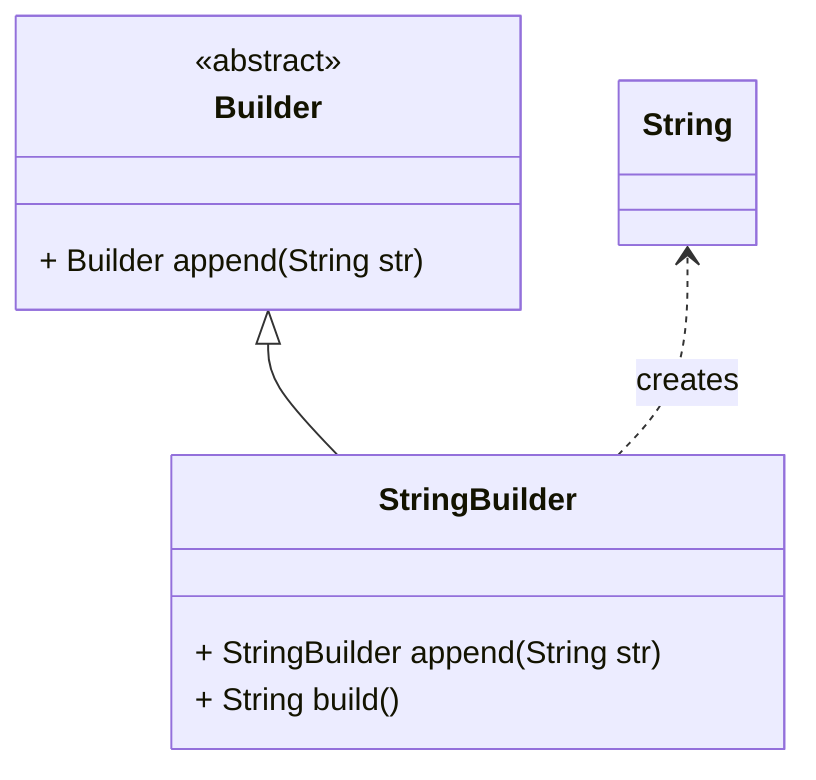

# Builder Pattern
vereinfachte Erzeugung komplexer Objekte durch Auslagerung in spezielle Klasse

## Vorteile
- bessere Erweiterung durch Modularisierung
- einfache Integration und Wiederverwendung
- "zeitlich gestreckte" Konstruktion: Fehlerbehandlung mit anschließender Fortsetzung möglich, keine Wiederholung vorheriger Schritte notwendig
- erleichterte Entwicklung im Team

## Nachteile
- enge Kopplung von Builder, Produkt und beteiligten Klassen

## Beispiel
