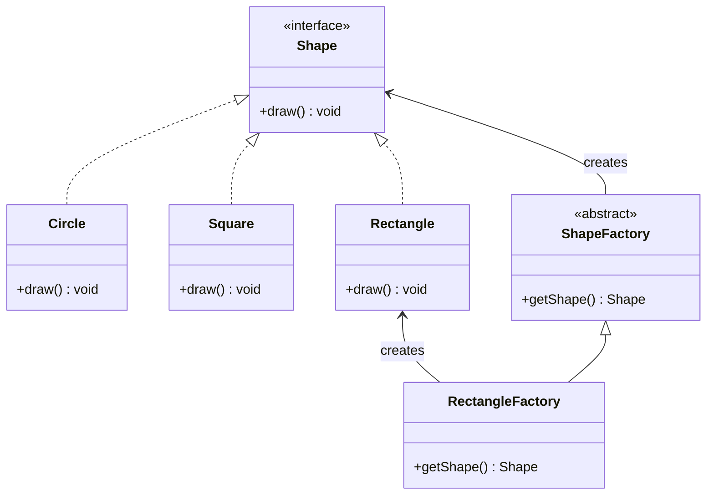

# Factory Method Pattern
als Schnittstelle zur Objekterzeugung, die Entscheidung welche konkrete Klasse genommen wird bleibt in der implementierenden Klasse

## Vorteile
- gekapselter (also austauschbarer) Konstruktionsprozess
- Default-Implementierungen möglich
- kann sicherstellen, dass immer ein Objekt zurückgegeben wird

## Nachteile
- enge Kopplung an das zu erstellende Produkt

## Beispiel
