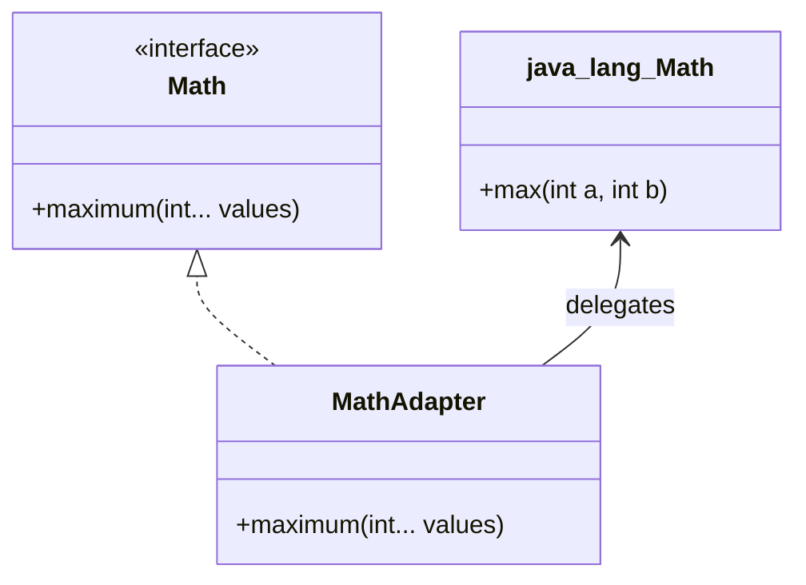

# Adapter Pattern
die Anpassung einer Schnittstelle an eine von Clients erwartete Schnittstelle. Das lässt Klassen zusammenarbeiten, die dazu sonst nicht in der Lage wären

## Vorteile
- Nutzung vorhandener Bibliotheken ohne sich an deren Schnittstelle anpassen zu müssen
- Entkoppelung von den Details vorhandener Komponenten
- Austausch der Schnittstelle im Adapter einfach möglich
- einzige Abhängigkeit ist Erzeugung des Adapters

## Nachteile
- Zusätzliche Delegation, Performance-Verlust
- scheinbar banale Operationen (z.B. sortieren einer Liste) können unerwartet teuer sein, da Datenstruktur im Hintergrund verborgen

## Beispiel
