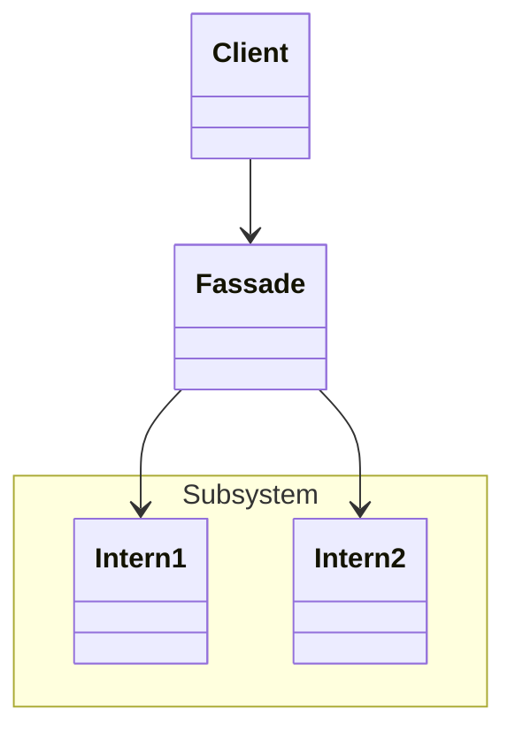

# Facade Pattern
vereinfachter Zugriff auf komplexes Subsystem oder Menge zusammengehöriger Objekte

## Vorteile
- Entkoppelung der Clients von den Details des Subsystems

## Nachteile
- kann umgangen werden, da in der Regel nur organisatorisches Mittel, nicht technisches
- Anpassung der Fassade bei Änderung interner Schnittstellen notwendig

## Beispiel
