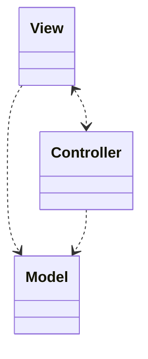

# Model View Controller (MVC) Pattern
Aufteilung der Verantwortlichkeiten bei Benutzerschnittstellen auf 3 verschiedene Rollen, Erleichterung der unterschiedlichen Präsentation ein und derselben Information

## Vorteile
- einfacher Austausch der Benutzeroberfläche möglich
- getrennte Testbarkeit erleichtert das Testen

## Nachteile
- hoher Implementierungsaufwand (komplexes Grundgerüst, Views müssen konsistent bleiben, ...)

## Aufbau
Auftrennung in Darstellung (View), Datenverwaltung (Model) und Eingabeverarbeitung und Datenänderungen (Controller)

Die View kann auch als Observer des Models realisiert werden. So werden Inkonsistenzen bei mehreren Views vermieden