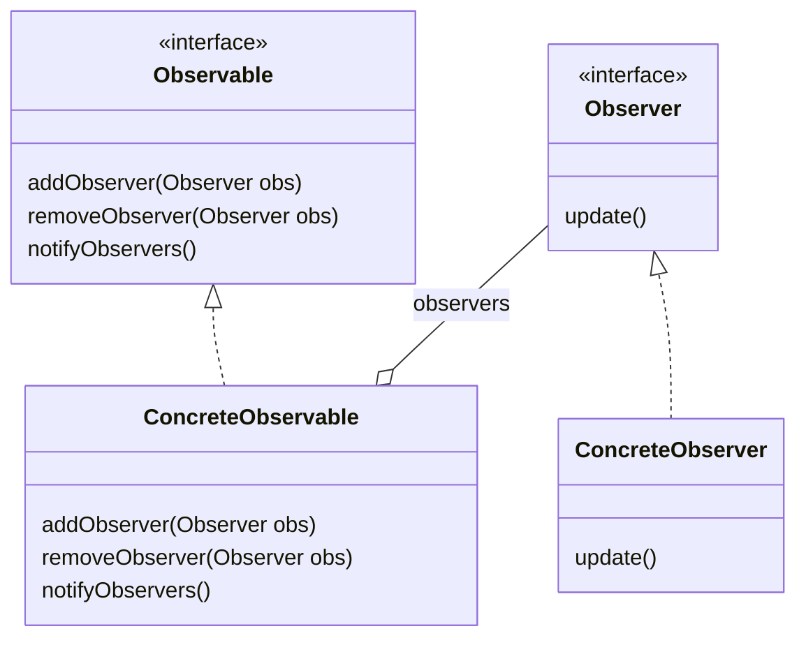

# Observer Pattern
Reaktion eines oder mehrerer Objekte auf die Zustandsänderung eines bestimmten Objektes, Anpassung des eigenen Zustands

## Vorteile
- lose Kopplung der abhängigen Objekte
- es muss nicht bekannt sein welche / wie viele Objekte sich zur Laufzeit registrieren
- einfach testbar

## Nachteile
- kann sehr komplex werden, insbesondere wenn auf unterschiedliche Weisen reagiert werden soll. Die Zunahme an Implementierungen macht anschließend aber die Entscheidung für die passendste schwieriger
- es ist nicht offensichtlich, was wann aktualisiert wird. Zirkuläre Abhängigkeiten können entstehen
- eine vergessene Abmeldung kann unerwünschte Nebeneffekte haben

## Beispiel
Hier mit dem pull-Ansatz (Observer müssen selbst schauen, was sich geändert hat), alternativ der push Ansatz (Mitteilung über parametrisierte update-Methode)
