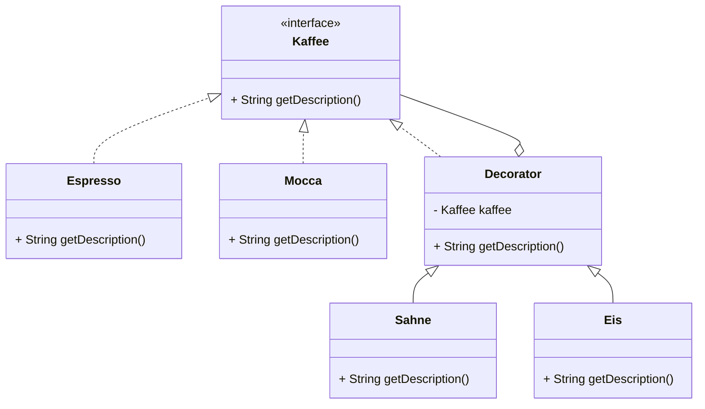

# Decorator Pattern
dynamische Ergänzung um Funktionalität, ohne die Komponente zu ändern

## Vorteile
- Komposition statt Vererbung → flexiblere Klassen, Modifikation zur Laufzeit
- Komponenten kennen Decorator nicht

## Nachteile
- Eventuell wenig übersichtlich bei vielen ähnlich aussehenden Klassen

## Beispiel
